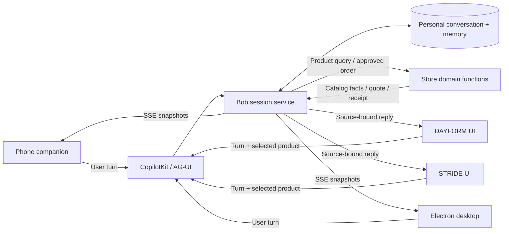

# From the position paper to the demo

The paper distinguishes conversation continuity from context continuity. This prototype makes both observable: a durable personal session holds the conversation and brief, while each turn includes the selected app product, size, and context revision. Merely switching an app tab changes neither the underlying session nor the destination of an in-flight reply.



## Semantics

- **User** chooses the brief, enables/revokes a store connection, authorizes disclosure of a structured budget, and approves an exact checkout.
- **Personal agent** preserves the session across surfaces, combines the bound app context with saved candidates, and sends a reply to the message's source. The default reasoner is a transparent deterministic demo; optional model generation handles explanations.
- **Store domain logic** owns products and sizes, computes its quote, revalidates price/stock at approval, and creates a simulated order. The personal agent cannot turn a visit or a product question into purchase authorization.

## Contracts in this prototype

`POST /api/agent` accepts an AG-UI run. `forwardedProps` includes:

```json
{
  "ownerSession": "personal-session-capability",
  "surface": "dayform",
  "sessionId": "source-ui-session-id",
  "productId": "day-one",
  "size": 9,
  "contextRevision": 3
}
```

The last user message supplies a stable `id`. The backend copies the context before any asynchronous work and validates the product's app ownership. It persists the user turn and the final response. Completed turns are replayed by ID; repeated quote approvals return the existing order. Per-personal-session locking rejects concurrent mutations with a retriable conflict instead of allowing duplicate checkout or lost updates. A server interruption during an unfinished turn is not automatically replayed; a production implementation needs durable pending-run recovery.

The event stream emits `RUN_STARTED`, `TEXT_MESSAGE_START`, `TEXT_MESSAGE_CONTENT`, `TEXT_MESSAGE_END`, `STATE_SNAPSHOT`, and `RUN_FINISHED` (or `RUN_ERROR`). The UI uses CopilotKit's actual `runAgent` and `HttpAgent`; the server-owned transcript drives cross-surface rendering. Store panels display their own turns. Phone and desktop panels display the full shopping conversation. Completed order receipts appear on the personal surfaces without a separate purchase request.

`GET /api/sessions/:id/catalog/:app` demonstrates the reverse context contract. Without budget disclosure, `authorizedContext` is empty. With explicit disclosure, only the budget enters store-owned price filtering. The activity trail records messages, context, memory changes, grants, tool results, and approvals.

`GET /api/sessions/:id/events` carries current snapshots to connected views. Reconnecting clients receive a full current snapshot, so missed notifications do not require conversation replay. The heartbeat maintains the connection without invoking the reasoner.

## Deliberate differences from a production paper implementation

1. The two fictional store frontends and domain functions share one host and one trusted owner session. The UI is not a security boundary. A production integration needs per-app scoped credentials and distinct owner/app projections, not the demo's full personal snapshot.
2. The paper describes a personal agent initiating outbound connections to app-hosted feeds. This demo instead exposes a central AG-UI HTTP endpoint to demonstrate the collaboration semantics with CopilotKit. It does not implement the outbound-only network topology or notification broker.
3. There is no actual presence estimation. An active tab is a local view choice; delivery uses the original message source. Uncertain device presence never reroutes a pending reply.
4. The companion uses a Telegram-inspired interaction pattern without contacting Telegram. The desktop is a real Electron window over the shared backend; mobile is a responsive web app with a manifest, not a native binary.
5. Shopping-only memory is exportable. Migration/import, memory encryption, external identity providers, distributed persistence, production telemetry, and independent integration by a third-party store remain future work.
6. Both product list prices fit the initial $120 budget, but checkout applies illustrative 10% tax. Day One totals $107.80; Arc 02 totals $123.20. The explicit over-budget approval is intentional.

The prototype demonstrates a controlled example. It does not establish the paper's hypotheses about interoperability, cost, general task success, or privacy at production scale.
